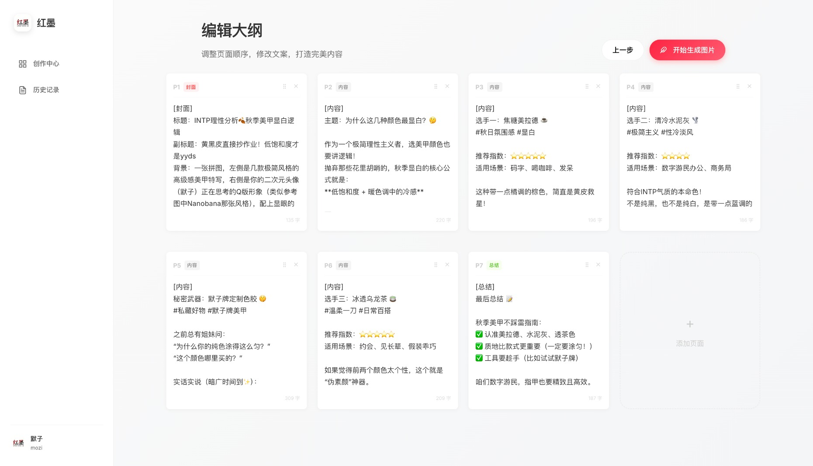

<div align="center">


# MotifLab

**让传播不再需要门槛，让创作从未如此简单**

输入你的创意主题，让 AI 帮你生成爆款标题、正文和封面图。

*本项目基于 [HisMax/RedInk](https://github.com/HisMax/RedInk) 及其衍生项目改进而来，在此衷心感谢原作者的卓越贡献！*

</div>

---

## 效果展示

### 输入一句话，生成完整图文

<details open>
<summary><b>Step 1: 智能大纲生成</b></summary>

<br>



**功能特性：**

- 可编辑每页内容
- 可调整页面顺序
- 自定义每页描述

</details>

<details open>
<summary><b>Step 2: 封面页生成</b></summary>

<br>


**封面亮点：**

- 符合个人风格
- 文字准确无误
- 视觉统一协调

</details>

<details open>
<summary><b>Step 3: 内容页批量生成</b></summary>

<br>


**生成说明：**

- 并发生成所有页面
- 支持单独重新生成不满意的页面

</details>

---

## 技术架构

<table>
<tr>
<td width="50%" valign="top">

### 后端技术栈

| 技术 | 说明 |
|------|------|
| **语言** | Python 3.9+ |
| **框架** | Flask |
| **文案AI** | Gemini / OpenAI |
| **图片AI** | Google GenAI |

</td>
<td width="50%" valign="top">

### 前端技术栈

| 技术 | 说明 |
|------|------|
| **框架** | Vue 3 + TypeScript |
| **构建工具** | Vite |
| **状态管理** | Pinia |
| **样式** | Modern CSS |

</td>
</tr>
</table>

---

## 快速开始

### 前置要求

- Python 3.9+
- Node.js 18+

### 1. 克隆项目

```bash
git clone https://github.com/urzeye/MotifLab.git
cd MotifLab
```

### 2. 一键启动

```bash
./start.sh
```

启动后自动打开浏览器访问 <http://localhost:5173>

*注：您可以在 Web 界面的**设置页面**直接配置您的外部模型 API 提供商及搜索功能。*

---

## 注意事项

1. **API 配额限制**: 注意大语言模型和图片生成 API 的调用配额方案。
2. **生成时间**: 由于批量并发和网络，图片生成需要一定时间，请耐心等待。
3. **敏感信息**: 切勿将带有明文 Key 的测试配置文件提交至版本控制。

---

## 开源协议

本项目基于原项目协议采用 [CC BY-NC-SA 4.0](https://creativecommons.org/licenses/by-nc-sa/4.0/) 协议开源。

**你可以自由地：**

- 个人使用 - 用于学习、研究、个人项目
- 分享 - 在任何媒介以任何形式复制、发行本作品
- 修改 - 修改、转换或以本作品为基础进行创作

**但需要遵守以下条款：**

- 署名 - 必须给出适当的署名（请提供指向原始协议及本项目 GitHub 链接的引用）
- 非商业性使用 - 不得将本作品用于商业目的
- 相同方式共享 - 如果修改，必须以相同的协议分发

---

## 致谢

- [HisMax/RedInk](https://github.com/HisMax/RedInk) - 本项目衍生的原仓库。感谢原作者出色的底层设计与开源奉献。

---

**MotifLab** - 让 AI 帮我们做更有创造力的事
